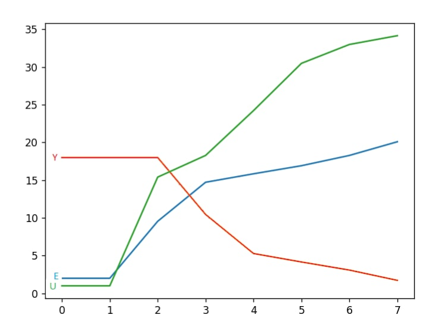

<p align="center"> Министерство образования Республики Беларусь</p>
<p align="center">Учреждение образования</p>
<p align="center">“Брестский Государственный технический университет”</p>
<p align="center">Кафедра ИИТ</p>
<br><br><br><br><br><br><br>
<p align="center">Лабораторная работа №1</p>
<p align="center">По дисциплине “Общая теория интеллектуальных систем”</p>
<p align="center">Тема: “Моделирования температуры объекта”</p>
<br><br><br><br><br>
<p align="right">Выполнил:</p>
<p align="right">Студент 2 курса</p>
<p align="right">Группы ИИ-23</p>
<p align="right">Швороб В.А.</p>
<p align="right">Проверил:</p>
<p align="right">Иванюк Д. С.</p>
<br><br><br><br><br>
<p align="center">Брест 2023</p>

---

# Общее задание

1. Написать отчет по выполненной лабораторной работе №2 в .md формате (_readme.md_) и с помощью **pull request** разместить его в следующем каталоге: **trunk\ii0xxyy\task_02\doc**.
2. Исходный код написанной программы разместить в каталоге: **trunk\ii00xxyy\task_02\src**.

---

# Выполнение задания

Код программы:

```C++
#include <iostream>
#include <vector>
#include <cmath>

using namespace std;

class NonlinerFunk {
private:
    double A, B, C, D, K, T0, TD, T, W, YS;
    double q0, q1, q2;
    double U = 1.0;
    double U_pre = 1.0;


    vector<double> y;
    vector<double> E;
    vector<double> um;

    double val;
public:
    NonlinerFunk(double A, double B, double C, double D, double K, double T0, double TD, double T, double W, double YS) {
        this->A = 0.5;
        this->B = 0.6;
        this->C = 0.6;
        this->D = 0.6;
        this->K = 0.8;
        this->T0 = 1.1;
        this->TD = 1;
        this->T = 1.1;

        this->YS = 2.0;
        this->W = 20;

        this->q0 = K * (1 + (TD / T0));
        this->q1 = -K * (1 + 2 * (TD / T0) - (T0 / T));
        this->q2 = K * (TD / T0);

        this->val = 0;
    };
    void nonliner() {


        y = { YS, YS };
        E = { W - YS, W - YS };
        um = { U, U };

        while (abs(y.back() - W) > 0.1) {
            E.push_back(W - y.back());
            U = U_pre + q0 * E.back() + q1 * E[E.size() - 2] + q2 * E[E.size() - 3];
            y.push_back(A * y.back() - B * y[y.size() - 2] + C * U + D * sin(U_pre));
            U_pre = U;
            um.push_back(U);
        }
    }
    void print() {
        cout << "Y" << "\n";
        for (double val : y) {
            cout << val << "\n";
        }
        cout << "\n";

        cout << "E" << "\n";
        for (double val : E) {
            cout << val << "\n";
        }
        cout << "\n";

        cout << "U" << "\n";
        for (double val : um) {
            cout << val << "\n";
        }
    }
};

int main() {
    double A = 0.5;
    double B = 0.6;
    double C = 0.6;
    double D = 0.6;
    double K = 0.8;
    double T0 = 1.1;
    double TD = 1;
    double T = 1.1;

    double YS = 2.0;
    double W = 20;

    NonlinerFunk nonliner(A, B, C, D, K, T0, TD, T, W, YS);

    nonliner.nonliner();
    nonliner.print();

    return 0;
}

```

Вывод программы:

```
Y
2
2
9.54488259088473
14.72045626256995
15.84238740241557
16.9142833350158
18.27675424142251
20.09178987481846

E
18
18
18
10.45511740911526
5.27954373743004
4.15761259758442
3.085716664984129
1.723245758577483

U
1
1
15.39999999999999
18.27690658846694
24.223675337828
30.49786907541605
33.0028316490363
34.1701010022209
```


